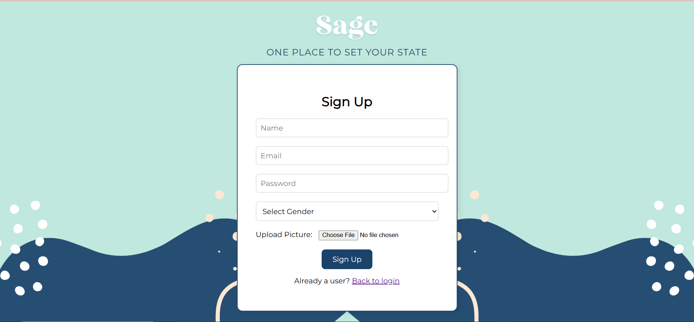
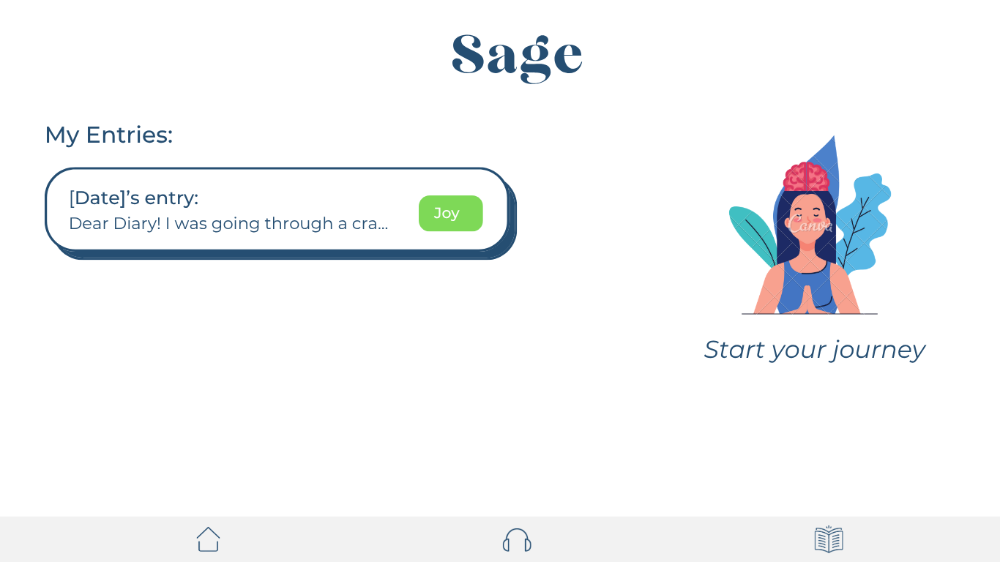
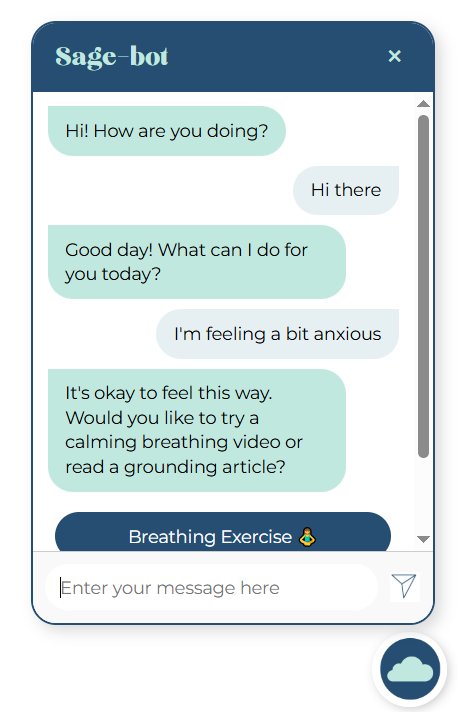

# 🌿 Sage: Your Mindful Companion

Sage is a web-based mental wellness companion designed to help users track emotions, reflect through journaling, and engage in light therapy using calming content. With AI-powered conversational support using Dialogflow, Sage provides a safe space to express feelings and find suitable coping tools.

---

## 💡 Features

- 🧠 **AI Chatbot**: Conversational interface powered by Dialogflow that responds with empathy and suggestions.
- 📝 **Emotion-Based Journaling**: Users can write journal entries with automatic emotion tagging using a smart emotion recognition backend built with Pytorch.
- 🎶 **Therapy Recommendations**:
  - Calming music
  - Uplifting videos
  - Breathing exercises
  - Motivational articles
- 💬 **Connect with a Therapist**: Suggests options to seek professional help based on user mood triggers (coming soon).
- 📊 **Emotion Analysis** *(Planned)*: Visual summaries of your emotional patterns.

---

## 🖼️ Sample Screens




---

## 🚀 Getting Started

### Prerequisites

- Python 3.x
- Flask
- MongoDB (running locally)
- Node.js (for potential future expansion)
- Google Cloud Project with Dialogflow Agent setup

### Installation

```bash
git clone https://github.com/sriya26/Sage.git
cd Sage
pip install -r requirements.txt
````

### Run the App

To run Flask locally:
```bash
python app.py
```
To run MongoDB locally:
```bash
mongod
```

Then open `http://localhost:5000` in your browser.

---

## 🧠 Dialogflow Integration

Sage uses Dialogflow for natural language understanding.

1. Create a Dialogflow agent in Google Cloud Console.
2. Enable the **Dialogflow API**.
3. Download the service account JSON file.
4. Set the environment variable:

```bash
export GOOGLE_APPLICATION_CREDENTIALS="path-to-your-json-file.json"
```

---

## 📁 Project Structure

```
Sage/
├── app.py
├── templates/
├── static/
│   ├── journal/
│   ├── journey/
│   ├── assets/
│   └── chatbot.js
├── fonts/
├── requirements.txt
└── README.md
```

---

## 📄 License

This project is licensed under the [MIT License](LICENSE).

---

## ✨ Acknowledgements

* Dialogflow by Google Cloud
* Pytorch for emotion recognition (optional module)
* Spotify & YouTube for therapeutic content
* Healthline articles for grounding and self-care references

---

## 🤍 Contributing

Pull requests are welcome! For major changes, please open an issue first to discuss what you’d like to change.

---

Stay mindful :)
